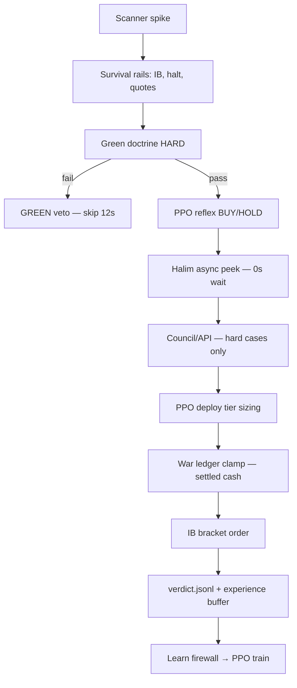

# PPO Wheel Architecture

**Status:** Active in `scripts/start_hanoon.sh` (PPO-led profile block, lines ~420–445)  
**Date:** 2026-07-01  
**Related:** [PPO_LED_COEVOLUTION_PROFILE.md](PPO_LED_COEVOLUTION_PROFILE.md) · [VISION_SMART_STACK.md](VISION_SMART_STACK.md) · [ENGINEERING_FIX_LOG.md](ENGINEERING_FIX_LOG.md)

---

## Mission

**One ship, one wheel.** After survival rails and **green doctrine** (the only hard mechanical entry gate), **PPO owns live entry/exit decisions**. Everything else teaches, sizes, or learns — it does not stack duplicate blockers.

| Role | Job | Blocks entry? |
|------|-----|---------------|
| **Green doctrine** | uptrend + green bar + pred up + profit prob + ai_vote | **YES** (only hard gate) |
| **PPO reflex** | BUY/HOLD + confidence; deploy tier | **NO** (acts after green) |
| **War $1k ledger** | virtual pool sizing, trips, settlement, IB sync | **NO** (advisory + cash cap only) |
| **Halim LM** | async monitor, blend, gold, coevolution | **NO** (`HALIM_ENTRY_AWAIT_SEC=0`) |
| **API teacher** | Groq/Gemini on hard cases | **NO** (labels for learn firewall) |
| **Lottery tier** | PPO `deploy_tier=lottery_bullet` sizing | **NO** (not commander 80% floors) |

---

## Decision flow (live spike)



---

## Environment profile (10/10 wheel)

Set in `scripts/start_hanoon.sh` **after** earlier exports (last wins):

### Chain enablers (unchanged from PPO-led)

| Variable | Value |
|----------|-------|
| `MAX_ENTRIES_PER_HOUR` | `0` (unlimited) |
| `WAR_MAX_ENTRIES_PER_HOUR` | `0` |
| `PPO_LEAD_WHILE_COUNCIL_PENDING` | `true` |
| `GREEN_DOCTRINE_ENTRY` | `true` |
| `COMMANDER_RUNTIME_ENABLED` | `false` |
| `SMART_STACK_STRICT_PROFIT_PROB` | `false` |
| `SMART_STACK_AI_SURE_ENTRY` | `false` |
| `HALIM_ENTRY_SOFT_VETO` | `false` |

### New wheel flags (2026-07-01)

| Variable | Value | Meaning |
|----------|-------|---------|
| `WAR_ENTRY_ADVISORY_ONLY` | `true` | War never `war:entry_veto`; posture notes only |
| `PPO_DEPLOY_TIERS_ENABLED` | `true` | normal / strong / lottery_bullet sizing from PPO |
| `LEARN_APPROVAL_REQUIRED` | `true` | PPO train only on Halim/API-approved buffer rows |
| `GREEN_VERDICT_RECHECK` | `false` | Skip duplicate green in verdict finalize |
| `HALIM_ENTRY_AWAIT_SEC` | `0` | Fully async Halim — no clock block before submit |
| `SMART_STACK_WAR_POSTURE` | `true` | Posture bumps annotate; no veto when advisory |

### Aligned advisory floors (~58%)

`MIN_PROFIT_PROBABILITY`, `WAR_MIN_PROFIT_PROBABILITY`, `CAPITAL_MIN_*`, `CONFIDENCE_THRESHOLD` — context for teachers, **not** extra hard blocks when advisory flags are on.

---

## Code map

| Module | Responsibility |
|--------|----------------|
| `core/war_entry_gates.py` | `war_entry_advisory_only()`, `_war_entry_veto_reason()`, `war_entry_advisory_context()` |
| `core/smart_stack.py` | `apply_smart_war_entry()` — advisory path when `WAR_ENTRY_ADVISORY_ONLY` |
| `core/war_account.py` | `rescale_decision_for_war()` — settled cash clamp; `check_entry_allowed()` skips pipeline veto |
| `core/ppo_deploy_tiers.py` | `classify_deploy_tier()`, `apply_deploy_tier_to_decision()` |
| `core/learn_approval.py` | `filter_for_ppo_training()`, `infer_learn_approval()` |
| `core/green_trade_doctrine.py` | `green_verdict_recheck_enabled()` — single green check in spike loop |
| `core/scalper_entry_executor.py` | Tier sizing → war rescale → IB submit |
| `core/ppo_reward_trainer.py` | `collect_training_records()` filters via learn firewall |
| `core/online_trainer.py` | Incremental train respects learn firewall |

---

## PPO deploy tiers

Conviction-based sizing **after** green + PPO BUY. Not a gate.

| Tier | Typical triggers | Size mult (env) |
|------|------------------|-----------------|
| `normal` | PPO BUY, baseline conf | `1.0` |
| `strong` | conf ≥ 0.62, prob ≥ 0.58, spike ≥ 1.35× | `PPO_STRONG_TIER_SIZE_MULT` (1.35) |
| `lottery_bullet` | conf ≥ 0.74, prob ≥ 0.70, spike ≥ 1.75×, score ≥ 55 | `PPO_LOTTERY_TIER_SIZE_MULT` (2.0) |

War `rescale_decision_for_war()` always clamps to settled cash / deploy cap.

**Commander lottery floors** (`COMMANDER_LOTTERY_*`) stay **off** at runtime; use for gold labels only.

---

## War advisory-only

When `WAR_ENTRY_ADVISORY_ONLY=true`:

- `war_entry_veto()` always returns `None`
- `apply_war_entry_veto()` attaches `war_advisory` dict; `enter` unchanged
- `apply_smart_war_entry()` skips profit-prob / posture **vetoes**
- `check_entry_allowed()` still enforces **settled cash**, trip caps, OBSERVE mode — physical limits, not doctrine

`war_advisory` fields: `war_would_veto`, `war_advisory_note`, `war_min_conf`, `war_min_prob`.

---

## Learn firewall

When `LEARN_APPROVAL_REQUIRED=true`:

- **All** events still append to `models/experience_buffer.jsonl` (audit + gold)
- **PPO reward / incremental train** uses `filter_for_ppo_training()` only

Auto-approved sources:

- `commander_ib_gold`, `teacher_ppo`, `halim_ppo_coevolution`, `halim_ppo_outcome`, `deferred_council`
- Closed trades with `halim_outcome` / `coevolution_stamped` / `teacher_action`
- Rows with explicit `learn_approved: true`

Unapproved spike-only rows are logged but do not move PPO weights until Halim/API stamps them.

---

## Halim async (participation — not blocking)

`HALIM_ENTRY_AWAIT_SEC=0` — PPO may submit while Halim inference is in flight. Halim **still participates** on every spike; it does not clock-block orders.

### What fires every `decide_entry` (live)

| Step | Module | Role |
|------|--------|------|
| 1 | `ai_commander_entry._ring_halim_entry` | Async MLX JSON inference via `:8765` serve |
| 2 | `halim_entry_line.merge_halim_entry_advisory` | Blend / complement when status=`fresh` |
| 3 | `halim_outcome_gold.register_entry_advisory` | Action gold for SFT / v4 training |
| 4 | `halim_ppo_coevolution.record_coevolution` | PPO↔Halim compare → correction log + buffer |
| 5 | `ai_commander_verdict._blend_halim_entry` | Finalize path stamps `halim_enter`, `halim_conf` |
| 6 | Deferred council | Late attach when Halim was `in_flight` at submit |

### Profile flags (wheel block)

| Variable | Value | Effect |
|----------|-------|--------|
| `HALIM_ENTRY_LM_ENABLED` | `true` | Local LM on |
| `HALIM_ENTRY_SOFT_VETO` | `false` | Halim **cannot** flip `enter=False` over PPO |
| `HALIM_PPO_COMPLEMENT` | `true` | Halim can lift PPO HOLD when conf clears bar |
| `HALIM_ENTRY_BLEND_WEIGHT` | `0.35` | Confidence nudge when Halim agrees |
| `HALIM_PPO_COEVOLUTION` | `true` | Mutual learning + learn-firewall auto-approve |
| `HALIM_ENTRY_AWAIT_SEC` | `0` | No wait — PPO leads; Halim catches up async |

### Fast path vs fresh Halim

On PPO-lead paths Halim may still be `in_flight` at order submit. That is **by design**:

- Ring always runs → gold + coevolution queue populated
- Blend applies when `consume()` returns `fresh` before finalize
- If missed live, deferred council + post-trade outcome dialogue still stamp `learn_approved` rows
- `LEARN_APPROVAL_REQUIRED=true` means PPO trains on Halim-stamped rows, not raw spikes alone

**Verify Halim is alive:**

```bash
curl -s http://127.0.0.1:8765/health   # or see logs/halim_serve.log
grep -E "Halim entry|halim_complement|coevolution" logs/scalper.log | tail -20
```

---

## Halim v4 — when stable on device

Colab training auto-names the next zip `halim_toddler_v4.zip` (see `halim/colab/colab_drive_setup.py`). Install on Mac:

```bash
# Drop zip in ~/Downloads or Drive sync path, then:
./scripts/halim_apply_colab_checkpoint.sh --if-new
./scripts/stop_hanoon.sh && ./scripts/start_hanoon.sh
```

**Same wiring, better brain** — no pipeline rewrite. v4 improves:

| Area | Today (toddler) | After stable v4 |
|------|-----------------|-----------------|
| Entry blend | Often `in_flight` on fast PPO path | More `fresh` JSON before finalize → stronger conf nudge |
| Complement | PPO HOLD → Halim enter lift | Higher accuracy on quality-led overrides |
| Coevolution | Corrections → gold | Richer `halim_ppo_coevolution` → more `learn_approved` PPO steps |
| API teacher | Hard cases when Halim missing/low conf | Fewer API rings as `halim_conf` rises (`brain_maturity`) |
| Learn firewall | Halim-stamped rows train PPO | Larger approved fraction of buffer |

### Suggested tuning after v4 is stable (manual)

```bash
export HALIM_ENTRY_BLEND_WEIGHT=0.42      # was 0.35 — trust local LM more
export HALIM_ENTRY_AWAIT_SEC=0.3          # optional micro-peek, still non-blocking
# Keep HALIM_ENTRY_SOFT_VETO=false — PPO still executes; Halim teaches
```

Optional future env (not coded yet): `HALIM_V4_BLEND_BOOST=true` to auto-raise blend weight when checkpoint manifest reports `v4+`.

Corrections feed learning; they do not retract live orders.

---

## Green doctrine (non-negotiable)

Green remains the **only** mechanical entry blocker. Do not disable `GREEN_DOCTRINE_ENTRY` to “get more trades.”

`GREEN_VERDICT_RECHECK=false` removes the **second** green check in `ai_commander_verdict` (spike loop already checked). Green veto logs unchanged.

---

## Apply and verify

```bash
./scripts/stop_hanoon.sh && ./scripts/start_hanoon.sh
```

**Expect in logs:**

1. `🟢 GREEN veto` when alignment missing — still normal
2. **No** `war:entry_veto` / `war:profit_prob_veto` when advisory on
3. `deploy_tier=strong` or `lottery_bullet` on high-conviction entries
4. `war advisory` notes on marginal setups (no block)
5. Halim logs without long `await` waits

**Tests:**

```bash
venv/bin/pytest tests/test_ppo_wheel.py tests/test_notify_ib_context.py -q
```

---

## Roll back

```bash
export WAR_ENTRY_ADVISORY_ONLY=false
export PPO_DEPLOY_TIERS_ENABLED=false
export LEARN_APPROVAL_REQUIRED=false
export GREEN_VERDICT_RECHECK=true
export HALIM_ENTRY_AWAIT_SEC=1.0
export COMMANDER_RUNTIME_ENABLED=true
./scripts/start_hanoon.sh
```

---

## Files in this release

| File | Change |
|------|--------|
| `core/war_entry_gates.py` | Advisory-only war path |
| `core/smart_stack.py` | Smart war annotate-only |
| `core/ppo_deploy_tiers.py` | **New** — tier classification + sizing |
| `core/learn_approval.py` | **New** — PPO train firewall |
| `core/green_trade_doctrine.py` | `GREEN_VERDICT_RECHECK`, fix unified gates |
| `core/war_account.py` | Skip pipeline veto when advisory |
| `core/scalper_entry_executor.py` | Tier → war sizing chain |
| `core/ppo_reward_trainer.py` | Learn filter on collect |
| `core/online_trainer.py` | Incremental learn filter |
| `core/ai_commander_verdict.py` | Optional green recheck skip |
| `scripts/start_hanoon.sh` | Wheel env profile |
| `tests/test_ppo_wheel.py` | **New** unit tests |
| `docs/PPO_WHEEL_ARCHITECTURE.md` | This document |
